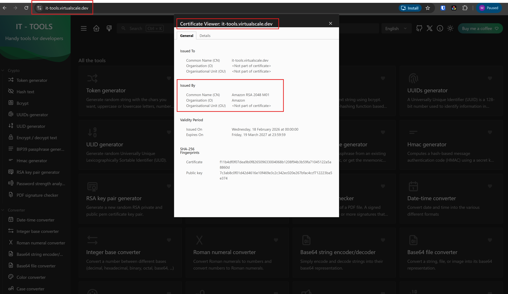
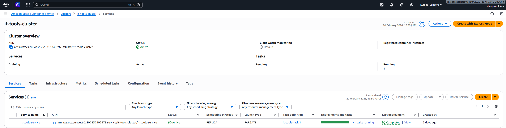
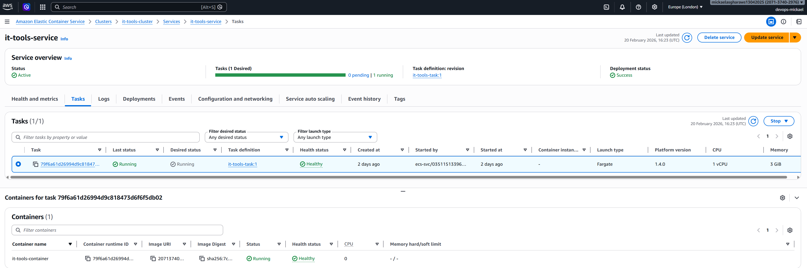

<picture>
    <source srcset="./.github/logo-dark.png" media="(prefers-color-scheme: light)">
    <source srcset="./.github/logo-white.png" media="(prefers-color-scheme: dark)">
    
</picture>

> **Note:** This repository is a deployment implementation built on top of the original [IT Tools](https://github.com/CorentinTh/it-tools) project by [CorentinTh](https://github.com/CorentinTh). All original application content, features, and intellectual property belong to their respective authors.

---

# Deployment of IT Tools App on AWS ECS

This documentation covers how to build, containerise, and deploy [IT Tools App](https://github.com/CorentinTh/it-tools) — an open-source developer utility app — to AWS as a production workload.

The app is containerised using Docker, hosted on **Amazon ECR**, orchestrated via **Amazon ECS with Fargate**, and served securely over HTTPS using **AWS ACM** and a custom subdomain: `it-tools.virtualscale.dev` hosted on **Cloudflare**.



## Tech Stack
- **App:** IT Tools (open-source, self-hostable).
- **Container registry:** Amazon ECR.
- **Orchestration:** Amazon ECS (Fargate — serverless).
- **Load balancer:** Application Load Balancer (ALB).
- **SSL/TLS:** AWS Certificate Manager (ACM).
- **Custom domain:** `it-tools.virtualscale.dev` hosted on Cloudflare.

## High-Level Architecture Overview

This project involves creating these AWS components in order:

1. **ECR Repository** - Stores your Docker container image.
2. **ECS Cluster** - Logical grouping where your containers run.
3. **Task Definition** - Blueprint defining how your container should run.
4. **Security Groups** - Firewall rules controlling network access.
5. **Target Group** - Routes traffic to healthy containers.
6. **Application Load Balancer (ALB)** - Distributes incoming traffic.
7. **ECS Service** - Maintains desired number of running tasks.
8. **ACM Certificate** - Provides SSL/TLS for HTTPS.
9. **DNS Record** - Points your domain to the load balancer.

**Flow:** User → Domain → ALB → Target Group → ECS Service → Container.

## Part 1: Local Development & Containerisation

### Step 1: Download the Application
```bash
git clone https://github.com/CorentinTh/it-tools.git
cd it-tools
```
- **What**: Clone the IT Tools repository.
- **Why:** Get the source code we'll containerise and deploy.

### Step 2: Update `nginx.conf`

**Note:** IT Tools already has `nginx.conf`, but we updated it to add the `/health` endpoint (ECS project requirement).
Replace `nginx.conf` with:
```nginx
server {
    listen 80;
    server_name _;
    root /usr/share/nginx/html;
    index index.html;

    location = /health {
        access_log off;
        return 200 '{"status":"ok"}';
        add_header Content-Type application/json;
    }

    location / {
        try_files $uri $uri/ /index.html;
    }
}
```
- **What:** Add a `/health` endpoint to nginx configuration.
- **Why:** AWS ALB requires a health check endpoint to verify containers are running properly. This endpoint returns `{"status":"ok"}` when the application is healthy.

### Step 3: Build Docker Image

```bash
docker build -t it-tools:latest .
```
- **What:** Build a Docker image from the Dockerfile.
- **Why:** Create a portable, self-contained package of the application that can run anywhere (locally or in AWS).

Note: Used the existing Dockerfile from the repository (no modifications needed).

### Step 4: Run Container Locally

```bash
docker run -d -p 80:80 --name it-tools-test it-tools:latest
```
- **What:** Run the Docker container on your local machine.
- **Why:** Test that containerisation works before pushing to AWS. Catches issues early.

### Step 5: Test & Verify Locally
```bash
# Test health endpoint
curl http://localhost/health

# Expected output: {"status":"ok"}

# Test in browser
# Open: http://localhost

# Check container status
docker ps
```
- **What:** Verify the container works correctly.
- **Why:** Ensure the health endpoint responds and the application loads before proceeding to AWS deployment.

### Step 6: Clean Up Local Container
```bash
docker stop it-tools-test
docker rm it-tools-test
```
 - **What:** Stop and remove the test container.
 - **Why:** Free up local resources; we'll run this in AWS instead.

### Key Changes Made:

- Updated nginx.conf to add `/health` endpoint.
- Used existing Dockerfile (no changes).
- Used existing .dockerignore (no changes).

## Part 2: Push to Amazon ECR

### What is ECR?
Amazon Elastic Container Registry (ECR) is a secure, managed Docker container registry. It stores your Docker images so ECS can pull and run them.

### Prerequisites
- AWS Account.
- AWS CLI configured.
- Region: `eu-west-2` (chosen specifically for our project).

### Step 1: Create ECR Repository
Via AWS Console:
1. Go to **ECR** → **Create repository**.
2. **Repository name:** `it-tools-app`
3. Click **Create**.

  - **What:** Create a private Docker registry in AWS.
  - **Why:** You need a place to store your Docker image where ECS can access it.

### Step 2: Authenticate Docker to ECR
```bash
aws ecr get-login-password --region eu-west-2 | docker login --username AWS --password-stdin <YOUR_AWS_ACCOUNT_ID>.dkr.ecr.eu-west-2.amazonaws.com
```
- **What:** Log in to your ECR registry.
- **Why:** Docker needs authentication to push images to your private ECR repository.

### Step 3: Tag Docker Image
```bash
docker tag it-tools:latest <YOUR_AWS_ACCOUNT_ID>.dkr.ecr.eu-west-2.amazonaws.com/it-tools-app:latest
```
- **What:** Tag your local image with the ECR repository URL.
- **Why:** Docker needs the full ECR path to know where to push the image.

### Step 4: Push to ECR
```bash
docker push <YOUR_AWS_ACCOUNT_ID>.dkr.ecr.eu-west-2.amazonaws.com/it-tools-app:latest
```
- **What:** Upload your Docker image to ECR.
- **Why:** Make the image available to ECS in the cloud.

### Step 5: Verify in ECR
```bash
aws ecr describe-images --repository-name it-tools-app --region eu-west-2
```
- **What:** Confirm the image was uploaded successfully.
- **Why:** Verify the image is available before proceeding to ECS setup.

## Part 3: Manual AWS Deployment using AWS Console

**Purpose:** Manually deploy to understand ECS architecture before automating with Terraform.

**Why Manual First?** Understanding the components and their relationships before writing Infrastructure as Code makes debugging easier and teaches you how everything connects.

### Prerequisite: Create the ECS Service-Linked IAM Role

Before creating any ECS resources, ensure the ECS service-linked role exists in your AWS account.

- **AWS Console:** IAM → Roles → Create role
   - **Trusted entity type:** AWS service
   - **Use case:** Elastic Container Service → Elastic Container Service
   - Click **Next** — `AmazonECSServiceRolePolicy` will be attached automatically
   - **Role name:** `AWSServiceRoleForECS`
   - Click **Create role**

- **What:** A service-linked role that allows ECS to manage AWS resources on your behalf.
- **Why:** Without this role, ECS cannot interact with load balancers, networking, or other AWS services needed to run your containers.

> **Note:** This role may already exist if ECS has been used in your account before. If you see it listed in IAM → Roles, you can skip this step.

### Step 1: Create ECS Cluster

1. **AWS Console:** ECS → Clusters → Create cluster
2. **Cluster name:** `it-tools-cluster`
3. **Infrastructure:** `AWS Fargate (serverless)`

<br>

- **What:** Create a logical grouping where your containers will run.
- **Why:** ECS Cluster is the foundation - it's like a "data center" for your containers. Fargate means AWS manages the underlying servers.

### Step 2: Create Task Definition

1. **AWS Console:** ECS → Task Definitions → Create new task definition
2. **Infrastructure:**
   - Family: `it-tools-task`
   - Launch type: `AWS Fargate`
   - OS/Architecture: `Linux/X86_64`
   - CPU: `0.5 vCPU`
   - Memory: `1 GB`
   - Task execution role: `ecsTaskExecutionRole`

3. **Container Configuration:**
    - Name: `it-tools-container`
    - Image URI: `<YOUR_AWS_ACCOUNT_ID>.dkr.ecr.eu-west-2.amazonaws.com/it-tools-app:latest`
    - Port mappings: `80 (TCP, HTTP)`

4. **Health check:**
   - Command: `CMD-SHELL,curl -f http://localhost/health || exit 1`
   - Interval: `30s`
   - Timeout: `5s`
   - Start period: `60s`
   - Retries: `3`

- **What:** A Task Definition is a blueprint/recipe for how to run your container.
- **Why:** It tells ECS which Docker image to use, how much CPU/memory to allocate, which ports to expose, and how to check if the container is healthy. Think of it as a detailed instruction manual.

### Step 3: Create Security Groups
1. **AWS Console:** EC2 → Security Groups → Create security group
2. **Security Group 1:** `ALB Security Group`
    - **Name:** `it-tools-alb-sg`
    - **Description:** `Security group for IT Tools ALB`
    - **VPC:** `Default VPC`
    - **Inbound rules:**
        - Type: `HTTP, Port: 80, Source: 0.0.0.0/0`
        - Type: `HTTPS, Port: 443, Source: 0.0.0.0/0`
    - **Outbound:** `All traffic (default)`

- **What:** Firewall rules for the Application Load Balancer.
- **Why:** Allow internet users to access your app via HTTP (port 80) and HTTPS (port 443).

3. **Security Group 2:** `ECS Task Security Group`
    -  **Name:** it-tools-ecs-sg
    -  **Description:** Security group for IT Tools ECS tasks
    -  **VPC:** Default VPC
    -  **Inbound rules:**
          -  Type: `Custom TCP, Port: 80, Source: it-tools-alb-sg`
    -  **Outbound:** `All traffic (default)`

- **What:** Firewall rules for your ECS containers.
- **Why:** Only allow traffic from the ALB to reach containers (port 80). This creates a secure architecture where containers aren't directly exposed to the internet—traffic must come through the ALB.

### Step 4: Create Target Group

- **AWS Console:** EC2 → Target Groups → Create target group
   - **Target type:** `IP addresses`
   - **Name:** `it-tools-tg`
   - **Protocol:** `HTTP`
   - **Port:** `80`
   - **VPC:** `Default VPC`
   - **Health checks:**
     - **Protocol:** `HTTP`
     - **Path:** `/health`
     - **Healthy threshold:** `2`
     - **Unhealthy threshold:** `3`
     - **Timeout:** `5s`
     - **Interval:** `30s`
     - **Success codes:** `200`
     - **Register targets:** `Skip (ECS auto-registers)`

<br>

- **What:** A target group tracks which containers are healthy and can receive traffic.
- **Why:** The ALB needs to know which container IPs to send traffic to. The target group monitors container health using the /health endpoint and only routes traffic to healthy containers. ECS automatically adds/removes containers from this group.

### Step 5: Create Application Load Balancer

- **AWS Console:** EC2 → Load Balancers → Create → Application Load Balancer
- **Basic configuration:**
    - Name: `it-tools-alb`
    - Scheme: `Internet-facing`
    - IP address type: `IPv4`

- **Network mapping:**
    - VPC: `Default VPC`
    - Mappings: `Select 2+ availability zones with public subnets`

- **Security groups:**
    - Remove default
    - Add: `it-tools-alb-sg`

- **Listener:**
    - Protocol: `HTTP`
    - Port: `80`
    - Default action: Forward to `it-tools-tg`

**Note the ALB DNS name:** `it-tools-alb-XXXXXXXXXX.eu-west-2.elb.amazonaws.com`
- **What:** An Application Load Balancer distributes incoming traffic across multiple containers.
- **Why:** Provides high availability (if one container fails, traffic goes to healthy ones), handles SSL termination, and gives you a stable endpoint. Even though we have 1 container now, the ALB architecture supports scaling to many containers later.

### Step 6: Create ECS Service
- **AWS Console:** ECS → Clusters → it-tools-cluster → Create service
- **Environment:**
    - Compute options: `Launch type`
    - Launch type: `FARGATE`

- **Deployment:**
    - Task definition: `it-tools-task:latest`
    - Service name: `it-tools-service`
    - Desired tasks: `1`

- **Deployment options:**
     - Scheduling strategy: `Replica`
     - Deployment strategy: `Rolling update`
     - Min running tasks %: `100`
     - Max running tasks %: `200`

- **Networking**:
    - VPC: `Default VPC`
    - Subnets: `2+ public subnets`
    - Security group: `it-tools-ecs-sg` (remove default)
    - Public IP: `ENABLED`

- **Load balancing:**
    - Type: `Application Load Balancer`
    - Load balancer: `it-tools-alb`
    - Listener: `80:HTTP` (use existing)
    - Target group: `it-tools-tg` (use existing)
    - Health check grace period: `60 seconds`

Wait for task status:
    - Last status: `RUNNING`
    - Health status: `HEALTHY` (takes 2-3 minutes)

- **What:** An ECS Service maintains the desired number of running tasks (containers).
- **Why:** If a container crashes, the Service automatically starts a new one. It also handles deployments (rolling updates with zero downtime) and integrates with the ALB. The Service is the "manager" that keeps your application running 24/7.

Once created, the cluster overview should show the service as **Active** with **1/1 tasks running** and deployment status **Completed**:



### Step 7: Test with ALB DNS
```bash
# Test health endpoint
curl http://it-tools-alb-XXXXXXXXXX.eu-west-2.elb.amazonaws.com/health
# Expected: {"status":"ok"}

# Open in browser
http://it-tools-alb-XXXXXXXXXX.eu-west-2.elb.amazonaws.com
```
- **What:** Verify the application is accessible via the load balancer.
- **Why:** Confirms all components are connected correctly before adding HTTPS and custom domain.

Before testing, confirm the task and container are both healthy in the ECS service detail view:



### Step 8: Request SSL Certificate
- **AWS Console:** Certificate Manager (ACM) - MUST BE IN eu-west-2 REGION
    - Click `Request certificate`
    - Certificate type: `Public certificate`
    - Domain names:
        - `it-tools.virtualscale.dev`
        - `*.virtualscale.dev` (optional wildcard)
    - Validation method: `DNS validation`
    - Key algorithm: `RSA 2048`
    - Click `Request`

> The CNAME records provided by ACM after requesting the certificate must be added to your DNS provider (Cloudflare) to validate domain ownership. This is covered in Step 9.
- **What:** Request a free SSL/TLS certificate from AWS.
- **Why:** HTTPS requires a valid SSL certificate. ACM provides free certificates that auto-renew, and they integrate seamlessly with ALB.

### Step 9: Validate Certificate in Cloudflare
> The `virtualscale.dev` domain is managed through Cloudflare. If your domain is with a different provider, apply the same CNAME records via their DNS console.

- **Cloudflare Console:** Cloudflare → DNS → `virtualscale.dev`
- **Add the validation CNAME records from ACM:**
    - For `it-tools.virtualscale.dev`:
        - **Type:** `CNAME`
        - **Name:** `_XXXXXXXX.it-tools` (copy from ACM, exclude .virtualscale.dev)
        - **Target:** `_XXXXXXXX.acm-validations.aws.` (copy full value from ACM)
        - **Proxy status:** `DNS only` (gray cloud)
        - **TTL:** `Auto`

    - For `.virtualscale.dev` (if added):
       - Type: `CNAME`
       - Name: `_XXXXXXXX` (just the hash)
       - Target: `_XXXXXXXX.acm-validations.aws.`
       - Proxy status: `DNS only` (gray cloud)
       - TTL: `Auto`

Wait `5-15 minutes` for certificate status to become "Issued".
- **What:** Prove to AWS that you own the domain.
- **Why:** AWS won't issue a certificate unless you prove domain ownership. Adding the CNAME record to your DNS is proof you control the domain.

### Step 10: Add HTTPS Listener to ALB
- **AWS Console:** EC2 → Load Balancers → it-tools-alb → Listeners → Add listener
    - Protocol: `HTTPS`
    - Port: `443`
    - Default action: Forward to `it-tools-tg`
    - Security policy: `ELBSecurityPolicy-2016-08` (or recommended)
    - Certificate: Select your ACM certificate (`it-tools.virtualscale.dev`)

- **What:** Configure the ALB to handle HTTPS traffic.
- **Why:** Enable secure, encrypted connections. The ALB handles SSL termination (decrypts HTTPS traffic) and forwards plain HTTP to containers.

### Step 11: Configure HTTP to HTTPS Redirect
 - **AWS Console:** EC2 → Load Balancers → it-tools-alb → Listeners → HTTP:80 → Edit
 - Change default action:
     - Remove current action
     - Add action: `Redirect`
     - Protocol: `HTTPS`
     - Port: `443`
     - Status code: `301 - Permanently moved`
     - Condition (if required):
       - Path: `/ (matches all)`

- **What:** Automatically redirect HTTP requests to HTTPS.
- **Why:** Force all users to use the secure HTTPS version. When someone types `http://it-tools.virtualscale.dev`, they're automatically redirected to `https://it-tools.virtualscale.dev`.

### Step 12: Point Domain to ALB (Cloudflare DNS)
- **Cloudflare Console:** Cloudflare → DNS → `virtualscale.dev` → Add record
    - Type: `CNAME`
    - Name: `it-tools`
    - Target: `it-tools-alb-260522106.eu-west-2.elb.amazonaws.com`
    - Proxy status: `DNS only` (gray cloud)
    - TTL: `Auto`

Wait `2-5 minutes` for DNS propagation

- **What:** Point your custom subdomain to the AWS load balancer.
- **Why:** Make the application accessible at a memorable domain name instead of the auto-generated AWS DNS name. Must be "DNS only" (not proxied through Cloudflare) for AWS SSL validation to work.

### Step 13: Final Test with Custom Domain
```bash
# Test health endpoint
curl https://it-tools.virtualscale.dev/health
# Expected: {"status":"ok"}

# Open in browser
https://it-tools.virtualscale.dev
```

**Expected result:** Valid SSL certificate (🔒) and IT Tools UI loading.

- **What:** Verify the complete deployment works end-to-end.
- **Why:** Confirms all components (DNS, SSL, ALB, ECS) are working together correctly.

---

## Part 4: Teardown (Before Terraform)

**Why Tear Down?** Before automating with Terraform, delete all manually-created resources. This ensures Terraform creates everything from scratch and proves you understand the architecture.

**Delete in this order to avoid dependency errors:**

1. **ECS Service**
   - ECS → Clusters → it-tools-cluster → Services → it-tools-service → Delete
   - **Why first:** Must stop tasks before deleting other resources.

2. **ECS Task Definition**
   - ECS → Task Definitions → it-tools-task → Deregister all revisions
   - **Why:** Clean up task blueprints.

3. **Application Load Balancer**
   - EC2 → Load Balancers → it-tools-alb → Delete
   - **Why:** ALB must be deleted before target group.

4. **Target Group**
   - EC2 → Target Groups → it-tools-tg → Delete
   - **Why:** Remove after ALB is gone.

5. **Security Groups**
   - EC2 → Security Groups → Delete:
     - `it-tools-alb-sg`
     - `it-tools-ecs-sg`
   - **Why:** Can only delete after resources using them are gone.

6. **ECS Cluster**
   - ECS → Clusters → `it-tools-cluster` → Delete
   - **Why:** Empty cluster can now be deleted.

7. **ACM Certificate** (optional - can reuse for Terraform)
   - Certificate Manager → Delete certificate
   - **Why optional:** Can reuse the same certificate for Terraform deployment.

8. **Cloudflare DNS** (optional - can keep for Terraform)
   - Delete `it-tools` CNAME record
   - Delete validation CNAME records
   - **Why optional:** Can reuse the same DNS records.

9. **ECR Repository** (optional - needed for Terraform)
   - **DON'T DELETE:** Keep the image for Terraform deployment.

---

## Resources Summary

| Resource | Name | Purpose |
|----------|------|---------|
| ECR Repository | it-tools-app | Stores Docker container image |
| ECS Cluster | it-tools-cluster | Logical grouping for containers |
| Task Definition | it-tools-task | Blueprint for running containers |
| ECS Service | it-tools-service | Maintains desired task count |
| ALB | it-tools-alb | Distributes traffic, handles SSL |
| Target Group | it-tools-tg | Routes to healthy containers |
| Security Group | it-tools-alb-sg | ALB firewall (allows 80/443 from internet) |
| Security Group | it-tools-ecs-sg | Container firewall (allows 80 from ALB only) |
| ACM Certificate | it-tools.virtualscale.dev | SSL/TLS certificate for HTTPS |
| DNS Record | it-tools.virtualscale.dev | Points domain to ALB |

---

## Common Issues & Solutions

**Task not starting:**
- **Issue:** Task execution role lacks ECR permissions.
- **Fix:** Ensure `ecsTaskExecutionRole` has `AmazonECSTaskExecutionRolePolicy` attached.
- **Issue:** No outbound internet access.
- **Fix:** Verify security group allows outbound traffic.

**Health check failing:**
- **Issue:** `/health` endpoint not responding.
- **Fix:** Verify nginx.conf has the health check location block.
- **Fix:** Check container logs: ECS → Cluster → Service → Task → Logs.
- **Issue:** Wrong health check path.
- **Fix:** Ensure target group health check path is `/health` not `health`.

**HTTPS not working:**
- **Issue:** Certificate not validated.
- **Fix:** Ensure certificate status is "Issued" in ACM.
- **Issue:** ALB blocking HTTPS.
- **Fix:** Verify `it-tools-alb-sg` allows port 443 inbound.
- **Issue:** No HTTPS listener.
- **Fix:** Check ALB has HTTPS:443 listener configured.

**Domain not resolving:**
- **Issue:** DNS not propagated yet.
- **Fix:** Wait 5-30 minutes for global DNS propagation.
- **Issue:** Cloudflare proxy enabled.
- **Fix:** Verify DNS record is "DNS only" (gray cloud, NOT orange).
- **Issue:** Wrong target.
- **Fix:** Test with `nslookup it-tools.virtualscale.dev` — should point to ALB.
- **Fix:** Try different DNS servers (1.1.1.1 or 8.8.8.8).

**Mobile not working but desktop works:**
- **Issue:** Mobile carrier DNS cache hasn't updated.
- **Fix:** Normal DNS caching — wait 10-30 minutes.
- **Fix:** Change phone DNS settings to 1.1.1.1.
- **Fix:** Use mobile data instead of Wi-Fi (different DNS).

---

## Architecture Flow
```
Internet User
    ↓
DNS (Cloudflare) → it-tools.virtualscale.dev → ALB DNS
    ↓
Application Load Balancer (it-tools-alb)
  - Port 80 → Redirect to 443
  - Port 443 → HTTPS (ACM Certificate)
    ↓
Target Group (it-tools-tg)
  - Health checks /health endpoint
    ↓
ECS Service (it-tools-service)
  - Maintains 1 running task
  - Auto-registers with target group
    ↓
ECS Task (from it-tools-task definition)
  - Fargate container
  - Pulls image from ECR
  - Runs IT Tools on port 80
```

## Next Steps

After completing manual deployment and teardown:

1. Rebuild everything using Terraform (Infrastructure as Code)
2. Set up CI/CD with GitHub Actions
3. Complete documentation and architecture diagram
